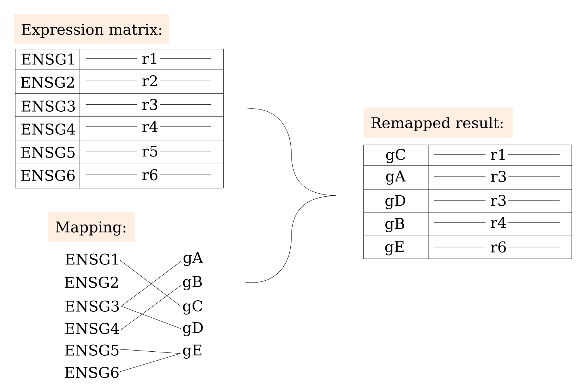

## About the WebMeV gene mapper

This is an WebMEV-compatible process for converting gene identifiers between different naming schemes.

Generally, we encourage users to *avoid conversion unless absolutely necessary*, as might be the case for certain analyses based on curated pathway databases. 

Gene identifier conversion is complicated by the fact that there is not a perfect one-to-one mapping between the same genomic locus in multiple naming systems. In some cases, a single ID in one system may map to multiple genes in another, which can introduce undesirable effects. 

As an example, consider the gene identified by ENSG00000277796 in the Ensembl system. This identifier maps to both gene symbols CCL3L1 and CCL3L3. If one were starting from CCL3L1, it is possible that after a re-mapping (i.e. symbol --> Ensembl --> symbol), the gene could be marked as CCL3L3 instead of the original CCL3L1. In some contexts, this might not matter. In others, this could present a problem. 

Similarly, there are situations where multiple identifiers in one naming scheme map to a single entity in the "target" scheme. For instance, two ENSG IDs can map to the same gene symbol. In this case, it is not clear which ENSG to use. **Note that in such cases where there is ambiguity in the mapping, such as when two ENSG IDs map to a single gene symbol, we retain the gene/row that has the maximum median absolute deviation.** This is based on the concept that a highly variable gene is likely to have more information content than a low-expressed or relatively constant gene. 

As a toy example, consider the following where we look to map the "ENSG" identifiers to gene symbols (gA, gB, etc.)


We make a couple of notes about the figure above:
- ENSG3 maps to *both* gA and gD. Thus, the remapped results have rows for gA and gD with the same contents (row r3). In the case of an actual mapping from Ensembl ENSG to gene symbols, this is **not** a common situation, but we show it here for completeness
- ENSG5 and ENSG6 both map to gE. In this instance, we choose the row with the largest MAD value. Here, that would be row r6, which corresponds to the original ENSG6. This situation is much more common in mapping Ensembl IDs to gene symbols. 

As part of the outputs of this process, we create a "map" file which shows how the mapping was performed. Users can then make edits after the fact, perhaps with more informed guidance.


**Map files**

Note that the mapping is performed by pre-made files that are included in the Docker image. However, we also make those available as part of the repository here. To create them prior to repository commits, we build the container and then run:
```
docker run -d \
    --rm \
    -v $PWD:/host \
    --entrypoint="" 
    <IMAGE NAME> cp -r /opt/software/resources /host
```
This will put the mapping files in `./resources/`. 